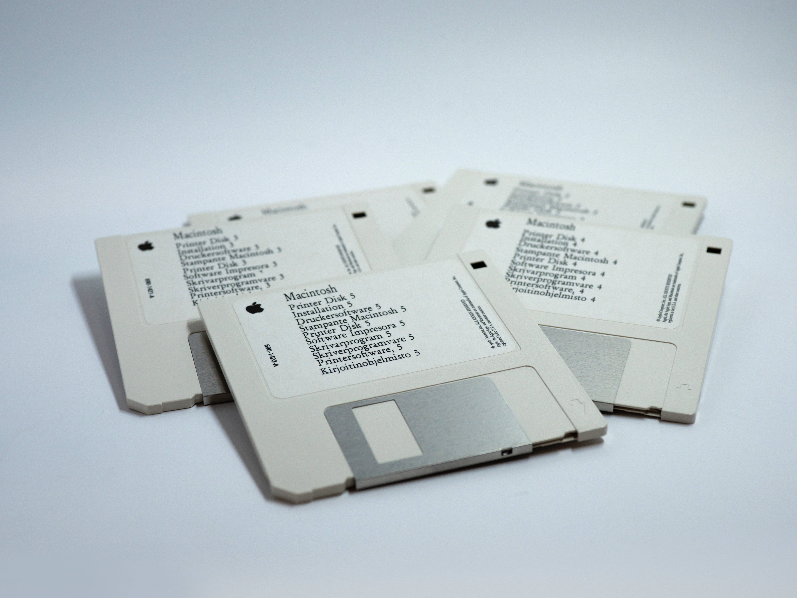

# <!--fit--> Software Development Lifecycle

# <!--fit--> Lesson 2

---

# Sommario - Modulo 2

1. Bootstrap di un progetto
2. Pianificare lo sviluppo
3. Ruoli
4. Step
5. Documentazione

---

### <!--fit--> Bootstrap di un progetto

---

Repository e versionamento

---

Scelta del linguaggio e delle tecnologie

---

Numeri di versione

---

CHANGELOG

---

README

---

CONTRIBUTING

---

BOILERPLATE

---

### <!--fit--> Pianificare lo sviluppo

## Da dove iniziare

---

Top Down

---

Bottom Up

---

Core First

---

Data Mock

---

### <!--fit--> Ruoli

## Chi fa cosa

---

Analista

---

DEV

---

Frontend developer

---

Backend developer

---

Fullstack developer

---

Web developer

---

DB developer

---

Tester

---

Project Manager

---

Ops

---

Dev-Ops

---

DBA

---

Cliente

---

### <!--fit--> Step di Progetto

## Come si è sempre fatto

---

Raccolta Requisiti

---

Analisi
(output funzionale)

---

Design
(output tecnica)

---

Sviluppo
(output codice)

---

Test

---

Validazione

---

Rilascio

---

Mantenimento

---

Evolutive

---

### <!--fit--> Documentazione

---

Scelte Tecniche

---

Manuale utente

---

Manuale di manutezione

---

Mappa infrastrutturale

---

Documentazione del codice

---

Commenti

---

Codice leggibile

---

Readme & Markdown

---

### <!--fit--> :ok_hand:

---

### Created by Aureliano Bergese

https://github.com/auridevil/
https://twitter.com/elmozzo
https://www.instagram.com/elmozzo_buendia/
https://medium.com/@elmozzo

This work is licensed under a [Creative Commons Attribution 4.0 International License][cc-by].

[![CC BY 4.0][cc-by-image]][cc-by]

[cc-by]: http://creativecommons.org/licenses/by/4.0/
[cc-by-image]: https://i.creativecommons.org/l/by/4.0/88x31.png
[cc-by-shield]: https://img.shields.io/badge/License-CC%20BY%204.0-lightgrey.svg
