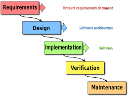

# <!--fit--> Software Development Lifecycle

# <!--fit--> Lesson 2

<style scoped>a { color: #eee; }</style>

---


# Sommario - Modulo 3

1. Agile
2. Scrum
3. Kanban

---


### <!--fit--> our new project!

### <!--fit--> (bootstrap)

---

# Repository e versionamento

- creazione repo su GitHub (o similare)
- clonare repo sulla propria macchina
- aggiungere collaboratori
- impostare eventuali webhook

---

# Scelta del linguaggio e delle tecnologie

- Conoscenze del dev-team
- Tempo a disposizione
- Espressività
- Dominio
- Librerie dedicate
- Trends e stimolo dei devs
- Design pattern

---

# Numeri di versione

Seguire le regole di semantic versioning [semver](https://semver.org/)

### <!--fit--> MAJOR.MINOR.PATCH (e.g. 2.4.12)

MAJOR: versione con cambiamenti incompatibili (breaking change)
MINOR: versione con nuove funzionalità, retrocompatibile
PATCH: versione con bug fixes e func fixes

1.0.0 è la prima versione matura, non la prima rilasciata
Si incrementa la versione quando del codice nuovo entra in _master_

---

# Documentazione in project

Sono file nella root del progetto, solitamente scritti in linguaggio Markdown:

- CHANGELOG
- README
- CONTRIBUTING

E' bene redarli e tenerli aggiornati fin dal principio.

(continua)

---

# CHANGELOG

Traccia lo storico delle funzionalità su _master_, associato al numero di versione e la data.

```
## [0.3.0] - 2021-31-02
### Added
- IT translation from [@schillaci](https://github.com/ttskill).
- force API to be async in params from [@auridevil](https://github.com/auridevil).
### Fixed
- Delay in microservices discovery from [@converge](https://github.com/converge)

## [0.2.9] - 2021-28-02
### Fixed
...
```

---

# README

- Cosa serve il progetto (short)
- I passi per far "partire" il progetto (comp)
- I passi per eseguire i test unitari (comp)
- Come interagire con il sw
- Chi ha scritto il progetto e con che licenza è rilasciato il sorgente
- Varie info aggiuntive

---

# CONTRIBUTING

- Messaggi di commit
- Branch naming
- Come fare un fork & pull
- Cosa è necessario per sottomettere una pull-request
- Livello minimo di coverage richiesto
- Convenzioni di codice / stile
- Filosofia dietro al progetto

---

# BOILERPLATE

E' utile tenere un repository boilerplate per i propri progetti, da cui partire velocemente a lavorare (con la documentazione in progetto, i folder per i sorgenti e i test, il gitignore, et cetera).

Una volta clonato il _boilerplate project_, cambiare origin:

```bash
$ git remote rm origin
$ git remote add origin git@github.com:auridevil/newprojectcool.git
$ git config master.remote origin
$ git config master.merge refs/heads/master
```

---


### <!--fit--> Pianificare lo sviluppo

##### <!--fit-->da dove iniziare

---

# Top Down

Si parte da una visione d'insieme e poco per volta si _specializza_.

_Divide et impera_:

- Identificazione delle macro funzionalità
- Suddivisione in sotto funzionalità
- Implementazione
- Ricostruzione della piramide

valorizza il **perché**, da cui il **come** emerge

---

# Bottom Up

Si parte da un'idea e si va iterativamente verso una visione, tramite _composizione_.

- Soluzioni già esistenti
- Soluzioni facili
- Creazione di unità funzionali

parte da un **come**, cercando di fare emergere un perchè

idale per _POC_ develpment (proof of concept) e validazione di soluzioni tecniche _quick'n'dirty_

---

# Core Approach

Si fa un design _top down_ ma si sviluppa _bottom up_.
Ordine di sviluppo

- le aree di maggiore rapporto complessità / valore
- le aree di alto valore e minore complessità
- le aree di basso valore e bassa complessità
- esclusione delle aree di basso valore e alta complessità

---

# About Mock

Componenti software (oggetti / api / database) che **fingono** una funzionalità ritornando staticamente dei dati. Utili per sviluppare e testare componenti senza attendere altri sviluppi.

```js
const getBookByID = async function(bookId) {
  return {
    id: bookId,
    title: "mocked book from db",
    isbn: "fakeisbn0123",
    ...{ otherStaticData },
  };
};
```

---


### <!--fit--> Step di Progetto

## (come si è sempre fatto)

---

# Raccolta Requisiti

- requisiti aziendali / stakeholder / funzionali / di soluzione
- surveys
- indagini di mercato
- analisi dei competitor
- analisi del legacy
- restrizioni di qualità

=> output: lista di requisiti

---

# Analisi

Si valutano i requisiti e si immagina un'esperienza utente, scoprendo le caratteristiche funzionali che il software dovrà soddisfare.
Per ogni punto si fa una valutazione della priorità e del rischio.
Solitamente è quello che viene firmato con il cliente prima di iniziare _a fare_. Definisce lo _scope_ del progetto.

=> output: analisi funzionale

---

# Design

Si valuta come implementare tecnicamente, architetturalmente e implementativamente la lista di richieste dell'analisi funzionale.
Si creano le **strutture dati** (data model), **i flussi**, i diagrammi delle **classi** (UML), le integrazioni con **sistemi terzi** e le interfacce per le **API**, e si documentano a fondo le decisioni prese.

Una buona analisi tecnica permette _a posteriori_ di essere una guida per i tecnici che dovranno mettere mano alla piattaforma software.

=> output: analisi tecnica

---

# Sviluppo

Nella fase di sviluppo si passa dall'analisi funzionale al codice, seguendo la guida dell'analisi tecnica.

Vengono applicate qui la più grande quantità di metodologie per la qualità del codice: test unitari, test end2end, test di integrazione, linting, code review, static code analysis, et cetera...

=> output: codice sorgente + **deploy** (test / demo / collaudo / integration)

---

# Test

Il sofware viene testato dai membri del team di sviluppo seguendo l'analisi funzionale.
Ogni richiesta non soddisfatta o anomalia nel funzionamento porta alla creazione di un _bug_ e fa ripartire un flusso di **sviluppo**.

In questa fase viene anche fatto il dummy user testing, per verificare la solidità della soluzione creata.

=> output: testbook (e correzione dei bug)

---

# Validazione - Collaudo

Il testbook viene validato dagli stakeholder, e eseguito da utenti estranei al team di sviluppo.

In questa fase si decide se è possibile _andare in produzione_ oppure è necessario un nuovo flusso di sviluppo.

=> output: via libera alla produzione

---

# Deploy (GoLive!)

Operazione di rilascio in produzione del sofware.
Potrebbe essere necessario bloccare temporaneamente altri attori e inibire l'accesso a determinati sistemi per la durata del rilascio.

Alla fine del rilascio _tecnico_ viene eseguito un testbook per validare che il software sia operativo e senza alterazioni.

Parallalemente viene redatto il manuale utente e i documenti tecnici necessari al mantenimento.

=> output: software **live** + documentazione

---

# Mantenimento (AM)

Questa fase è di duranta uguale alla vita del software. Comprende tutte le attività manuali di routine:

- pulizia spazi e tabelle temporanee
- aggiornamento dei sistemi operativi ospitanti
- aggiornamenti delle librerie del sistema
- correzione di bug e anomalie
- indicizzazione e storicizzazione dei dati

---



---

# Evolutive (CR)

Sono le richieste aggiuntive ad un progetto esistente.
Per un blocco di evolutive si segue tutto il processo, dai requisiti al mantenimento.

---


### <!--fit--> Ruoli

---

# Analista

E' il primo a prendere in mano i requisiti. Il suo lavoro è progettare e ingenierizzare il software partendo dai requisiti.

Non è un tecnico ma ha idea delle possibilità tecnologiche del team ed è in grado di creare il software richiesto _in prosa_, nell'analisi.

---

# UX Designer

Aiuta l'analista nella fase di definizione di _come sarà il software_. Utilizza varie metodologie per _pensare_ il software più efficace possibile e inidirizzare eventuali requisiti non emersi in prima fase.

Tramite la creazione di **wireframes** fornisce al cliente un'anteprima dell'esperienza utente e al team di sviluppo un'idea del desiderata.

---

# DEV

Mettiamo sotto il gruppo _dev_ tutti quelli che si occupano di sviluppo, ossia dell'attività di scrivere del codice.

---

# Frontend developer

Il programmatore di frontend si occupa del livello di presentazione del progetto, solitamente le interfacce grafiche.

Non esiste una regola che definisce dove finisce il compito di un FE dev e dove inizia quello di un BE dev, ma sono i team / le organizzazioni a stabilirlo.

Un bravo FE dev è in grado di scrivere sia test unitari sia test automatici.

In fase di lavorazione il FE dev lavora usando un _mock backend_.

---

# Backend developer

Lo sviluppatore di backend si occupa del livello di business logic del progetto, scrive e implemente il cuore delle applicazioni, le interazioni con i database, le API.

Un bravo BE dev è in grado di scrivere sia test unitari che test di integrazione end to end.

---

# Fullstack developer

Lo sviluppatore fullstack si muove agilmente sia nel BE che nel FE.

Non è necessario che sia eccellente in entrambi gli ambiti, ma sapersi orientare su tutto il codice gli permette di avere un visione d'insieme maggiore.

Ragionare _fullstack_ è fondamentale quando si usano quei design pattern ([link](https://en.wikipedia.org/wiki/Software_design_pattern)) che non dividono il sofware tra presentazione e business logic.

---

# Web developer

Il web developer si occupa di sviluppo di piccoli siti web.

La differenza con un Frontend developer o un Fullstack developer è che questi ultimi utilizzano le tecnologie web per creare applicazioni web, mentre invece il web developer si occupa di siti di medio-piccola entità e bassa complessità.

Tipicamente il web developer non lavora in team, ma è un freelance solitario.

---

# DB developer (deprecated)

Il db-dev è colui che si occupa dello sviluppo (e test + manutenzione) di _stored procedure_, _triggers_, db functions et simile.

La difficoltà del versionamento di tali soluzioni e la poca praticità di mantenimento stanno spostando le logiche fuori dal database e questo ruolo sta scomparendo, comunque capita ancora di trovare annunci di lavoro per db-dev.

---

# Tester

Il tester si occupa di redarre, eseguire e mantenere il test-case. Si occupa di verificare che le implementazioni siano completate e identificare eventuali regressioni.

Lavora a stretto contatto con il team di sviluppo, sovente ne è parte. Ha una formazione tecnica ma non una spiccata abilità nello sviluppo.

Un buon tester è una figura molto difficile da trovare e può fare la differenza in un team.

---

# Technical Leader

Si occupa della guida tecnica del team. Redige la analisi tecnica del progetto ed è il referente tecnologico degli stakeholder.

Prende le decisioni di tipo tecnico e infrastrutturale e aiuta il team nel raggiungimento del traguardo, anche sviluppando lui stesso.

---

# Project Manager (PM)

E' responsabile della riuscita del progetto.
Si occupa di tempi e costi ed è colui che decide la composizione del team.

Si fa aiutare per le questioni funzionali dall'analista, per le questioni tecniche dal technical leader.

---

# IT Operations (ops)

E' responsabile dei livelli più bassi del progetto, anche se solitamente il suo lavoro è di _servizio_, ma non prende parte alle dinamiche del team.

Si occupa di networking, server fisici, sistemi operativi, backup, configurazioni degli application server / web server.

Con l'avvento del _cloud computing_ si occupa di configurare le macchine virtuali, le reti e le infrastrutture più o meno complesse, nei servizi cloud (_aws_, _azure_, _digitalocean_, _heroku_, et cetera).

---

# Dev-Ops

E' il punto di congiunzione tra un _dev_ e un _ops_. Si occupa di gestire le infrastrutture cloud tramite strumenti automatizzati di deploy, provisioning, integrazione, mantenimento e orchestrazione.

La direzione è quella del **infrastructure as code** (IaC), dove le operazioni di infrastruttura vengono definite da definizioni di operazioni tramite codice, standardizzato e versionabile, invece di utilizzare strumenti di configurazione e _conf_ file.

---

# DBA

L'amministratore del database si occupa di installare, amministrare e ottimizzare le performance di grossi database relazionali.

Può essere assimilato a un ops ma richiede conoscenza specifica profonda del database amministrato.

Si occupa anche di backup, ruoli, accessi, sicurezza.

---

# Security Engineer

L'esperto di sicurezza, solitamente esterno al team, si occupa di fare _assessment_ di sicurezza sul progetto maturo.

E' un ruolo molto quotato e il numero di esperti di sicurezza **bravi** è estremamente basso.

---

# Stakeholders

Sono tutti i portatori di interesse legati al progetto software.

Ognuno ha la propria necessità di valore dal software e le proprie priorità.

Distinguere tra **_utente finale_** e **_cliente_** e **_finanziatore_**.

---


### <!--fit--> Documentazione

---

# Ufficiale

- Analisi Funzionale
- Analisi Tecnica
- Manuale Utente
- Mappe infrastrutturali
- Diagramma delle classi
- Data Model
- Manuale di manutenzione

---

# Documentazione in project

- README
- CONTRIBUTING
- CHANGELOG
- git log
- codice auto-documentante
- /_ commenti _/ (solo se super necessari)
- configurazioni del linter / IDE

---

# Markdown

Linguaggio di markup dalla sintassi semplice e dalla facile conversione in html.

Rispetto a html e LaTex è più facile da leggere e editare senza un'approfondita conoscenza.

```bash
# Documentazione in project
- README
- CONTRIBUTING
- CHANGELOG
---
```

---


### <!--fit--> DEV OPS

---

# (Accenni di devops)

Insieme di pratiche che combinano lo sviluppo software con le IT operations.

- ridurre la lunghezza del ciclo di vita del software
- continuous delivery
- sofware di qualità superiore
- automatizzare tutto il possibile

---

# Strumenti

- vcs
- continuous integration
- continuous testing
- continuous deployment
- automatic provisioning
- infrastructure as code
- monitoring tools
- self healing infrastructures & HA

---


### <!--fit--> :ok_hand:

---


### Created by Aureliano Bergese

https://github.com/auridevil/
https://twitter.com/elmozzo
https://www.instagram.com/elmozzo_buendia/
https://medium.com/@elmozzo

This work is licensed under a [Creative Commons Attribution 4.0 International License][cc-by].

[![CC BY 4.0][cc-by-image]][cc-by]

[cc-by]: http://creativecommons.org/licenses/by/4.0/
[cc-by-image]: https://i.creativecommons.org/l/by/4.0/88x31.png
[cc-by-shield]: https://img.shields.io/badge/License-CC%20BY%204.0-lightgrey.svg
