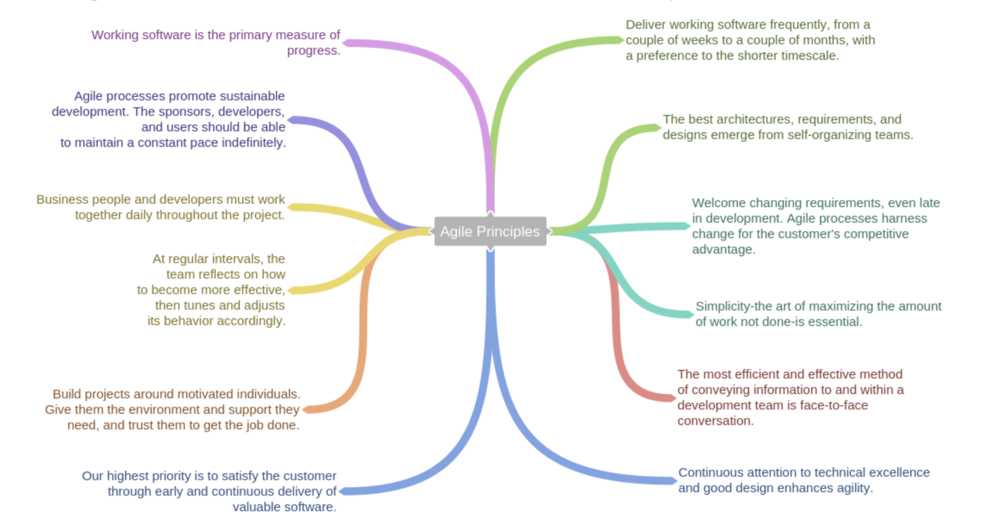
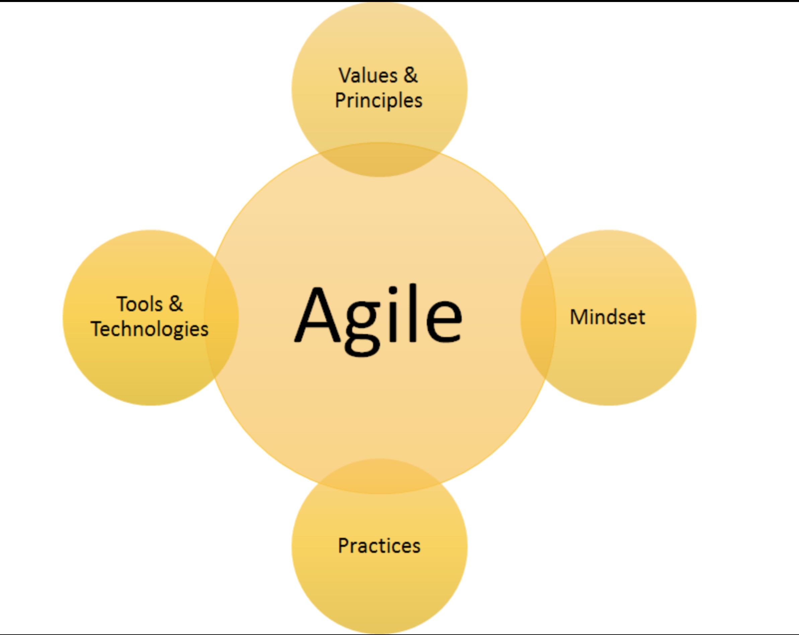
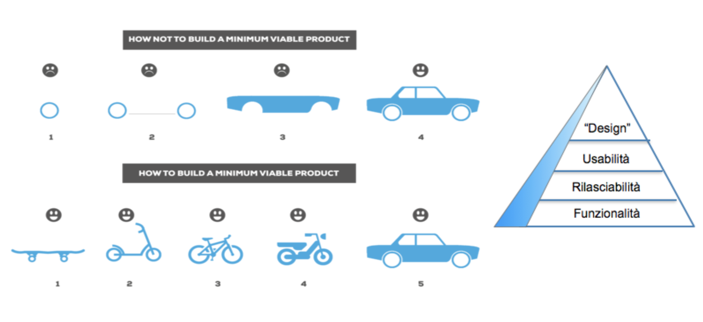
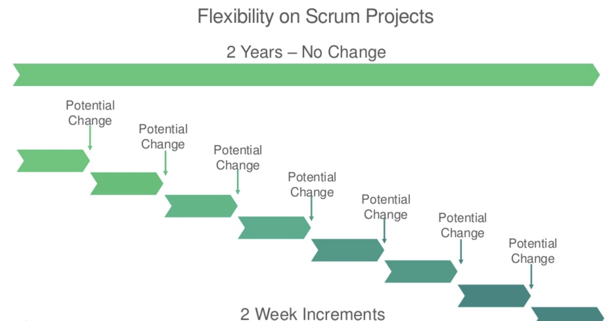
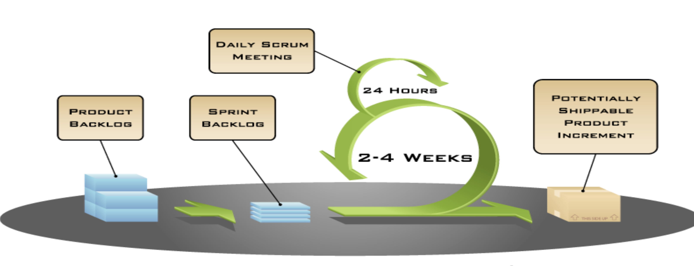
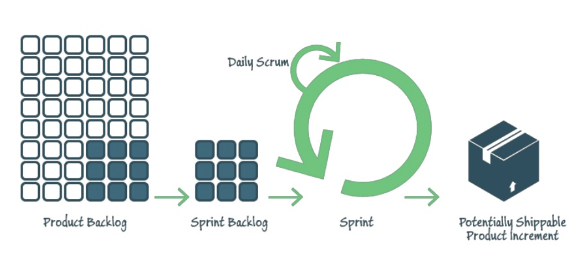

# <!--fit--> Software Development Lifecycle

# <!--fit--> Lesson 3

---

# Sommario - Modulo 3

1. Agile
2. Scrum
3. Kanban

---

TEMP

Scrum is a method, agile is a mindset.
Fare agile è diverso da avere un mindset agile.

---

## <!--fit--> AGILE

---

\
\
\
(quote)

## <!--fit-->_fare_ agile è diverso da _avere_ un _mindset_ agile.

---

# Storia

\
\
2001
Kent Beck, Robert Martin, **Martin Fowler**, e altri... Pubblicazione dell'**Manifesto for Agile Software Development**.

---

# Agile Manifesto:

### <!--fit--> **Individuals** and **Interactions** over _processes_ and _tools_

### <!--fit--> **Working Software** over _comprehensive documentation_

### <!--fit--> **Customer Collaboration** over _contract negotiation_

### <!--fit--> **Responding to Change** over _following a plan_

---

---

---

## <!--fit--> About waterfall..

---

---

# Minimum Viable Product

1. MVP è il prodotto con più alto ritorno di investimenti rispetto al rischio (wikipedia).

2. MVP è una metodologia di sviluppo orientata ad avere il prima possibile una versione con funzionalità essenziali per gli _early adopter_.

3. Un MVP è un sofware rilasciabile, che permette di raccogliere immediatamente informazioni sull'utilizzo.

---

## 

---

## <!--fit--> SCRUM

---

\
\
\
(quote)

## <!--fit-->Scrum is a method, agile is a mindset.

---

# SCRUM

- framework _agile_ creato da Ken Schwaber e Jeff Sutherland
- framework per sviluppare e sostenere prodotti complessi
- non una tecnica, non un processo
- **controllo empirico** da cicli di feeback frequenti in opposizione al _command and control_
- facile da capire
- difficile da padroneggiare
- leggero
- basato sulla scrum guide (19 pag.) [scrumguides.org](https://www.scrumguides.org/)

---

## 

---

## 3 pilastri

## 5 valori

## 3 ruoli

## 5 eventi

## 3 artefatti

---

## Empirismo

\
La conoscenza arriva dall'esperienza e le decisioni si basano su ciò che si conosce.
\
\
Scrum applica un metodo iterativo ad approcio incrementale per ottimizzare la prevedibilità e il controllo del rischio.

---

# I 3 Pilastri

- **trasparenza**: gli aspetti significativi del processo devono essere visibili ai responsabili del risultato
- **ispezione**: è un aspetto critico dell'empirismo, può essere fatta sia sul prodotto, che sulle persone, che su ogni aspetto di scrum
- **adattamento**: viene dall'ispezione e va applicato il prima possibile per iniziare un nuovo ciclo di (trasparenza) ispezione e adattamento.

---

# I 5 Valori

- impegno
- coraggio
- concentrazione (focus)
- apertura
- rispetto

I valori vanno vissuti per dare vita ai pilastri e creare **fiducia**.
Scrum si nutre di e alimenta questi valori.

---

# Scrum TEAM

Lo scrum team è

- auto organizzato: sceglie come meglio compiere il proprio lavoro
- cross funzionale

Il modello serve per ottimizzare:

- flessibilità
- creatività
- produttività

---

# Scrum TEAM

- Product Owner (PO)
- Dev Team (DEV)
- Scrum Master (SM)

---

## Product Owner (ruolo)

Il Product Owner ha la responsabilità di massimizzare il valore del prodotto risultante dal lavoro svolto dal Team di Sviluppo.

E' il responsabile reale del prodotto e tutti devono rispettare le sue decisioni. Nessun'altro ha il permesso di dire al dev team su cosa lavorare.

---

## Product Backlog (artefatto)

Il Product Backlog è un elenco ordinato di tutto ciò che è noto essere necessario al prodotto.

Esso è l’unica fonte di requisiti per le modifiche da apportare al prodotto.

Il Product Owner è il responsabile del Product Backlog, compreso il suo contenuto, la sua disponibilità e l’ordinamento dei suoi elementi.

Il productr backlog non è mai completo ed è documentazione di quello che è stato e quello che sarà il prodotto.

---

L'oridine rappresenta l'importanza e la conoscenza dei requisiti (storie).

Gli elementi ordinati più in alto sono solitamente più chiari e meglio dettagliati rispetto a quelli più in basso.

Il dev-team e il product owner si occupano, duranto lo sprint, di fare attività di **raffinamento**, per migliorare la descrizione dei requisiti e fornirne alcune stime.

---

Il Product Owner è l'unica persona responsabile della gestione del **Product Backlog**:

- chiarezza degli elementi
- corretto ordinamento degli elementi per raggiungere gli obietti
- ottimizzazione del lavoro del devteam
- visibilità, trasparenza e chiarezza del product backlog
- comprensione da parte dei membri del devteam

---

## devteam (ruolo)

Professionisti che lavorano **insieme** per consegnare un **incremento** di prodotto **done** potenzialmente rilasciabile alla fine di ogni **sprint**.

- auto organizzati
- cross funzionali
- non esistono titoli o gerarchie interne
- non esistono sotto-team
- il team nel complesso ha la responsabilità condivisa, non esistono responsabilità per specializzazione / area

---

TUTTO IL DEV TEAM E' EGUALMENTE RESPONSABILE VERSO IL PRODUCT OWNER.

## Dimensione:

2 Pizzas Rule: 3-9 persone

Team troppo piccoli: rischio di mancanza di skill
Team troppo grossi: troppa complessità rispetto a quella gestibile empiricamente

---

## Scrum Master (ruolo)

\
Responsabile di promuovere e sostenere SCRUM. Aiuta chiunque a comprendere teoria - pratiche - regole - valori.
\
\
E' un leader al servizio dello scrum team (**servant leadership**).

---

### Scrum Master servant per PO

- assicura che gli obiettivi siano chiari a tutti nello scrum team
- cerca tecniche efficaci per la gestione del product backlog
- supporta la comprensione della pianificazione empirica
- aiuta il po a massimizzare il valore
- facilita gli eventi di scrum **come richiesto e necessario**

---

### Scrum Master servant per DEV

- allena il team all'auto organizzazione e alla cross-funzionalità
- aiuta a creare prodotti di alto valore
- elimina gli ostacoli di avanzamento
- facilita gli eventi di scrum **come richiesto e necessario**
- assiste (e protegge) il dev team in ambienti in cui scrum non è ancora pienamente adottato o compreso

---

# EVENTI

- sprint
- daily scrum
- sprint review
- sprint retrospective
- sprint planning

Creano regolarità quindi consistenza
Minimizzano i meeting non definiti in scrum
Sono timeboxed e supportano trasparenza e ispezione
Riducono la complessita grazie alla predittibilità

---

## Sprint (evento)

Periodo **time-boxed** di [1-4] settimane durante la quale viene creato un **incremento** di prodotto potenzialmente rilasciabile (**done**).

E' di durata costante (e invaribile, in corsa).

Alla fine di uno sprint parte immediatamente un nuovo sprint.

Contiene tutti gli altri eventi:lo Sprint Planning, i Daily Scrum, il lavoro di sviluppo (non un evento), la Sprint Review e la Sprint Retrospective.

---

Ogni sprint ha un **obiettivo** di ciò che si va a costruire e uno **Sprint Goal** (deciso dal PO).

Durante:

- non possono essere fatte modifiche che mettano a rischio il goal
- gli obiettivi di qualità non devono degradarsi
- la visibilità può essere chiarita e rinegoziata tra il Product Owner e il devteam, quando si è appreso di più.

---

## 

---

## Daily Scrum (standup meeting) (evento)

max 15 min - solo per il dev team - tutti i giorni

- cosa ho fatto ieri
- cosa farò oggi
- ci sono eventuali impedimenti che bloccano il mio lavoro

no discorsi tecnici
no discussioni
no risoluzione problemi

lo scrum master presenzia (ma non interviene)

---

## Spint Review (evento)

Alla fine di ogni sprint - max 4 ore

Il dev team mostra quello che ha fatto al PO e a eventuali stakeholder (_demo_)

Si parla di quello che è andato **bene** e dei problemi incontrati

Il product owner **accetta** (o meno) gli elementi fatti come incremento

---

## Sprint Planning (evento)

Si pianifica il lavoro da eseguire nello sprint che sta per iniziare, max 8 ore.

- definizione dello **sprint goal**
- decisione dell'incremento da portare al prodotto durante lo sprint

Si prendono gli elementi in testa al **product backlog** e si mettono nello **sprint backlog**. Il devteam è l'**unico** che può decidere quanti elementi prendere.

---

## 

---

## Sprint Backlog (artefatto)

Insieme degli elementi del Product Backlog selezionati per lo Sprint.

Previsione fatta dal Team di Sviluppo riguardo a quale funzionalità sarà presente nel prossimo **Incremento**, e riguardo al lavoro necessario per consegnare tale funzionalità in un Incremento **done**.

Aggiornato durante lo sprint per meglio raggiungere lo sprint goal.

Immagine in tempo reale del lavoro che il Team di Sviluppo prevede di compiere durante lo Sprint

**di esclusiva appartenenza del Team di Sviluppo**

---

## Incremento (artefatto)

$$ I = I(n) + I(n-1) $$

Somma di tutti gli elementi del product backlog completati duranto uno sprint e del valore degli incrementi degli sprint precedenti.

Il nuovo incremento deve risultare **done** per essere considerato tale.

E' un passo verso la visione/obiettivo e ogni incremento deve essere ispezionabile.

Deve essere _potenzialmente rilasciabile_.

---

## Definition of Done (DoD)

Tutti devono capire quando un elemento del backlog è **done**.
Dod è un documento, condiviso e pragmatico che sancisce cosa si intende per **done**.

La DoD guida lo scrum team nella fase di sprint planning, e può cambiare solo alla fine di uno sprint.

La propone l'organizzazione ma gli scrum team possono approfondirla.

---

## Sprint Retrospective (evento)

E' un'occasione per lo scrum team per ispezionare se stesso e creare un piano di miglioramento per il prossimo sprint. max 3h

- ispezione ultimo sprint: persone, relazioni, processi, strumenti
- identificare gli elementi che sono andati bene e possibili miglioramenti
- creare un piao di miglioramenti per il team (action points)

Fornisce una opportunità formale per focalizzare l’ispezione e l’adattamento

---

### Sprint Planning Meeting

- sprint review
- chiusura dello sprint
- sprint retrospective
- sprint planning
- avvio dello sprint

---

### Approfondimenti

- [scrum guide](https://www.scrumguides.org/docs/scrumguide/v2017/2017-Scrum-Guide-Italian.pdf)

- Henrik Kniberg - Scrum and XP from the Trenches - 2nd Edition
- [scrum.org](https://www.scrum.org/)
- [scrum alliance](https://www.scrumalliance.org/)

- [heart of agile](https://heartofagile.com/)

---

## <!--fit--> Kanban

---

\
\
\
(quote)

## <!--fit-->just limit your wip

---

### <!--fit--> :ok_hand:

---

### Created by Aureliano Bergese

https://github.com/auridevil/
https://twitter.com/elmozzo
https://www.instagram.com/elmozzo_buendia/
https://medium.com/@elmozzo

This work is licensed under a [Creative Commons Attribution 4.0 International License][cc-by].

[![CC BY 4.0][cc-by-image]][cc-by]

[cc-by]: http://creativecommons.org/licenses/by/4.0/
[cc-by-image]: https://i.creativecommons.org/l/by/4.0/88x31.png
[cc-by-shield]: https://img.shields.io/badge/License-CC%20BY%204.0-lightgrey.svg
