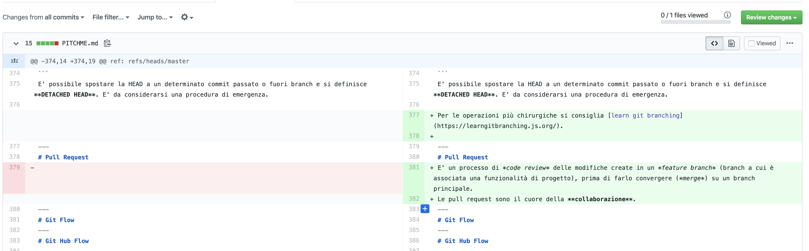

# <!--fit--> Software Development Lifecycle

# <!--fit--> Hints & Insights

<style scoped>a { color: #eee; }</style>

---

## Presentation as a code


Questa presentazione è scritta in codice markdown e _buildata_ con
[marp](https://marpit.marp.app/).

Il repository del sorgente è su [github](https://github.com/auridevil/iis_classes_2019_src).

L'hosting e il _continuous deployment_ sono forniti da [netlify](https://www.netlify.com/)

👉 https://gest-progetti-iis.netlify.com/

---


## Aureliano Bergese (fullstack@mondora)


Explorer
Functional Programming enthusiast
Father of 2
Professional Scrum Product Owner

---


# Sommario

1. Intro
2. Versionamento
3. Git
4. Esercizi

---


### <!--fit--> Introduzione

## Entità nello sviluppo software nel 2109.

---

# SUBJECTS (cosa)

- progetto: ciò che dobbiamo realizzare
- prodotto: uno o più progetti, volti a fornire un servizio unificato
- valore: benefit fornito dal prodotto
- revenue: guadagno fornito dal prodotto al proprietario

---

# STAKEHOLDERS (chi)

- team: chi lavora al progetto
- utenti finali: chi usa il prodotto
- clienti: chi commissiona il progetto
- funder: chi mette i soldi per il progetto

---

# ENVIRONMENTS (dove)

- dev: per i programmatori del team
- test: per i tester del team
- integration: per le altre entità che concorrono al progetto
- demo: per mostrare le funzionalità al cliente / funder
- preproduction: per i tester del prodotto
- production: per gli utenti finali

---


### <!--fit--> Versionamento

---

# Un VCS traccia la storia dei cambiamenti di persone e team che lavorano insieme ad un progetto.

Un DVCS lo fa in maniera distribuita.

---

# Perchè? per rispondere alle domande:

- quali modifiche sono state fatte?
- chi ha fatto le modifiche?
- quando sono state fatte le modifiche?
- perchè sono state richieste le modifiche?

---


---


### <!--fit--> GIT

---


(Distributed) Version Control System
(git = idiota)

Linus Torvalds 2005
Junio Hamano v1 (attualmente mantainer)

Basato su **checksum** di file e folder (per la velocità)

---

# Repository

Un repository (repo) o git-project è l'insieme di file e folder associati ad un progetto. Comprende anche lo storico delle modifiche.

---

# Crea nuovo (locale)

```bash
git init
```

---

# Clona esistente (remoto)

```bash
git clone https://github.com/auridevil/iis_classes_2019_src.git
cd iis_classes_2019
```

---

# Branching

un branch è un ramo dell'albertatura della storia del codice
il branch principale è **master**


---

Tutti i branch del repo

```bash
mox@urania$ git branch
  branchdemo
* master
(END)
```

Cambia branch attivo

```bash
git checkout branchdemo
```

---

Crea nuovo branch

```bash
git branch funzionalita1425
```

Crea nuovo branch e utilizza

```bash
git checkout -b funzionalita1425
```

---

# Aggiungi

L'aggiunta di un set di modifiche è in due fasi: staging e commit.
**git add** aggiunge alcune modifiche allo stage

Aggiungi modifica di un file

```bash
git add PITCHME.md
```

---

Aggiungi tutte le modifiche

```bash
git add .
```

Aggiungi modifiche di un folder

```bash
git add assets/*
```

NB la cancellazione è una modifica. Solitamente il renaming / move è considerata cancellazione + aggiunta.

---

**git commit** salva lo snapshot delle modifiche (sul branch correente) e completa il tracciamento

commit con editor

```bash
git commit
```

commit inline

```bash
git commit -m "this is a inline commit message"
```

---

# Commit message (best practices)

- usare l'imperativo
- max 50 chars
- no punti finali
- dichiarare le modifiche fatte ad alto livello
- includere eventuali riferimenti a documentazione (e.g. jira code, tiketing...)

---

```bash
git commit -m "[type][branch] What is done "
```

type è il tipo di modifica:

- feat: funzionalità nuova
- fix: correzione errore
- chore: piccola sistemazione
- test: copertura del codice
- doc: documentazione

Se il branch è master, si esclude dal commit message.

---

# Status

```bash
mox@urania$ git status
On branch master

No commits yet

Changes to be committed:
  (use "git rm --cached <file>..." to unstage)

	new file:   game.txt
```

---

# Diff

Mostra le differenze non ancora nell'area di staging (pre _git add_)

```bash
git diff
```

Mostra le differenze tra staging e l'ultima modifica

```bash
git diff --staged
```

---

# Unstage

Rimuovi un file dall’area di staging, ma mantieni le modifiche:

```bash
git reset game.txt
```

---

# Merge (locale)

Combina le modifiche fatte su due branch differenti. E' direzionale: merge **of** un branch **into** un'altro branch.


---

Porta le modifiche di **branch1** in **branch2**

```bash
git checkout branch2
git merge branch1
```

Porta le modifiche di **branch2** in **master**

```bash
git checkout branch2
git merge master
git checkout master
git merge branch2
```

---

# Conflitti

```bash
mox@urania$ git merge master
CONFLICT (add/add): Merge conflict in sample2.txt
Auto-merging sample2.txt
Automatic merge failed; fix conflicts and then commit the result.
```

file in conflitto:

```bash
><<<<<<<< HEAD
code from the current branch
=======
code from master branch
<>>>>>>>> master
```

---

modificare a mano il file in conflitto per ottenere

```bash
code mix from both branches
```

aggiungere la modifica al branch per completare il merge

```bash
git add sample2.txt
git commit -m "merge from master"
```

---

# Remote

E' possibile aggiungere un server remoto (se non si è partiti da un clone) per usare git distribuito:

```bash
git remote add origin https://github.com/auridevil/iis_classes_2019_src.git
```

il nome di default del remote è _origin_. Per verificare l'aggiunta:

```bash
mox@urania$ git remote -v
origin	https://github.com/auridevil/iis_classes_2019_src.git (fetch)
origin	https://github.com/auridevil/iis_classes_2019_src.git (push)
```

---

# Pull

Per ottenere le modifiche dal server su master:

```bash
git pull origin master
```

o (unsafe):

```bash
git pull
```

---

per _pullare_ un branch:

```bash
git pull origin branch3
```

git pull prova a mergiare in locale quello che c'è sul server, se serve più controllo si può usare _git fetch_ (avanzato)

```bash
git fetch
```

---

# Push

Per inviare le modifiche al server da locale, sul branch remoto di master:

```bash
git push origin master
```

per _pushare_ su un branch particolare, remoto:

```bash
git push origin branch3
```

---

# Merge (remote)

Porta le modifiche di **branch2** in **master**, con fast-forward

```bash
git checkout master
git pull origin master
git checkout branch2
git merge master
git push origin branch2
git checkout master
git merge branch2
git push origin master
```

---

Porta le modifiche di **branch2** in **master**, con conflitto:

```bash
git checkout master
git pull origin master
git checkout branch2
git merge master
<fix conflict>
git add .
git commit -m "merge from master"
git push origin branch2
git checkout master
git merge branch2
git push origin master
```

---

# Rebase

Prendi tutti i cambiamenti fatti su un branch e portali su un altro

```bash
git rebase branch3
```

Warning: il rebase è pericoloso da usare. E' facile alterare la salute del repository, l'utilizzo è sconsigliato salvo rari casi di emergenza (seguire le guide ufficiali online).

---

# Incompleti

Capita di voler mettere da parte delle modifiche incomplete, per farlo si usa lo _stash_ (una specie di cut'n'paste gigante).
Aggiungi tutte le modifiche (non staged) allo stash:

```bash
git stash
```

Riapplica le modifiche nello stash

```bash
git stash apply
```

---

# Storico

E' possibile vedere lo storico dei commit da cli:

```bash
git log
```

---

# File ignorati

E' quasi sempre necessario NON versionare alcuni file e folder, ad esempio dove sono contenute password o stringhe di connessione ai database, i file compilati, i file degli editor e le dipendenze.
Per questo si mette nella root del progetto un file _.gitignore_ dove si indicano i file (regex allowed) da ignorare. Git non vedrà modifiche a questo tipo di file, né traccierà la loro esistenza.

[Git Hub .gitignore list](https://github.com/github/gitignore)

---

# Tag

E' possibile aggiungere dei tag ad un determinato commit su un determinato branch (solitamente master), ad esempio per tracciare un rilascio, o una breaking change:

```bash
git tag -a v1.5.2 -m "Version 1.5.2 on westeurope + northeurope servers PROD"
git push --tags origin master
```

---

# HEAD

La HEAD del repository locale è un puntatore al branch attuale

```bash
mox@urania$ cat .git/HEAD
ref: refs/heads/master
```

E' possibile spostare la HEAD a un determinato commit passato o fuori branch e si definisce **DETACHED HEAD**. E' da considerarsi una procedura di emergenza.

Per le operazioni più chirurgiche si consiglia [learn git branching](https://learngitbranching.js.org/).

---

# Pull Request

E' un processo di _code review_ delle modifiche create in un _feature branch_ (branch a cui è associata una funzionalità di progetto), prima di farlo convergere (_merge_) su un branch principale.
Le pull request sono il cuore della **collaborazione**.

```bash
.... (from `git push origin branch-to-PR` output)
remote: Resolving deltas: 100% (2/2), completed with 2 local objects.
remote:
remote: Create a pull request for 'branch-to-PR' on GitHub by visiting:
remote:      https://github.com/auridevil/iis_classes_2019_src/pull/new/branch-to-PR
remote:
To https://github.com/auridevil/iis_classes_2019_src.git
 * [new branch]      branch-to-PR -> branch-to-PR

```

---


---



---

E' possibile fare il merge se

- non ci sono conflitti
- c'è un numero sufficiente di _approve_ (da stabilire con il team)
  

---

# Git Hub Flow

Workflow semplice in 6 punti per la collaborazione con git:

1. **create branch**: feature branch, dal branch di deploy (solitamente master), orientato alla feature
2. **commit**: aggiungere in piccoli step le modifiche necessarie alla feature
3. **pull-request**: per massimizzare la trasparenza, tutto ciò che va su master deve passare da pull-request

---

4. **code-review**: si fanno test e code review collettiva di team, per valutare la bontà della soluzione e del codice, eventuali modifiche necessarie riportano al punto 2
5. **merge**: si porta master nel feature branch, si controlla che tutto sia coerente e poi si porta il feature branch in master; il feature branch viene chiuso (opzionalmente si fa un tag)
6. **deploy**: si pubblica il codice modificato, manualmente o tramite un processo di continuous deployment. Se non possibile, bisogna comunque considerare il codice come deployabile (production ready)

---

# Git Flow (accenni)

In questo workflow ci sono alcuni branch fissi per ogni stage degli environment (**dev**,**test**,**demo**,**master**,etc).
Le modifiche vengono fatte su un feature branch, creato a partire dal branch **dev**.
"Quando il team è soddisfatto di una feature" la porta nel branch di **dev** dove si prova la convivenza con le altre feature sviluppate.
Il codice in **dev\*** viene promosso in **test** / **integration** e viene sottoposto a controllo manuale / automatico delle funzionalità.

---

Quindi il codice viene promosso in **demo** / **preprod** e viene validato con il cliente / product owner.
Insieme al cliente si stabilisce una data di rilascio in cui si promuove il codice in **master** e quindi di deploya in produzione.
Eventuali bug di produzione vengono fixati creando un branch da **master** e, a fix completato, riportando le modifiche su tutti gli ambienti, compreso quindi master.

[Approfondimento](https://datasift.github.io/gitflow/IntroducingGitFlow.html)

---

# Fork and pull

Workflow legato all'open source, figlio del github flow. Necessario quando non si hanno i permessi per lavorare su un repository che si vuole modificare.

1. **fork**: fare un fork nel proprio account di un repository remoto
2. **commit**: aggiungere nel proprio repo le modifiche fatte
3. **pull-request**: richiedere un merge dal proprio repository a quello originale
4. **code-review**: i mantainer e la community faranno una code review e valutaranno se mergiare la modifica nel repository originale

---

# Git as-a-service

- [Git Hub](https://www.github.com)
- [Git Lab](https://about.gitlab.com)
- [Bitbucket](https://bitbucket.org/)

# Tools


- [Atlassian Sourcetree](https://www.sourcetreeapp.com/)
- [Visual Studio Code](https://code.visualstudio.com/Download)

---

---

# Approfondimenti


- [Git Cheat Sheet](https://github.github.com/training-kit/downloads/it/github-git-cheat-sheet/)
- [Learn Git Branching](https://learngitbranching.js.org/)
- [Git Hub Learning Lab](https://lab.github.com/)
- [Visualizing Git](http://git-school.github.io/visualizing-git/)
- [Git Hub Flow](https://guides.github.com/introduction/flow/)

---


### <!--fit--> :ok_hand:

---


### Created by Aureliano Bergese

https://github.com/auridevil/
https://twitter.com/elmozzo
https://www.instagram.com/elmozzo_buendia/
https://medium.com/@elmozzo

This work is licensed under a [Creative Commons Attribution 4.0 International License][cc-by].

[![CC BY 4.0][cc-by-image]][cc-by]

[cc-by]: http://creativecommons.org/licenses/by/4.0/
[cc-by-image]: https://i.creativecommons.org/l/by/4.0/88x31.png
[cc-by-shield]: https://img.shields.io/badge/License-CC%20BY%204.0-lightgrey.svg
